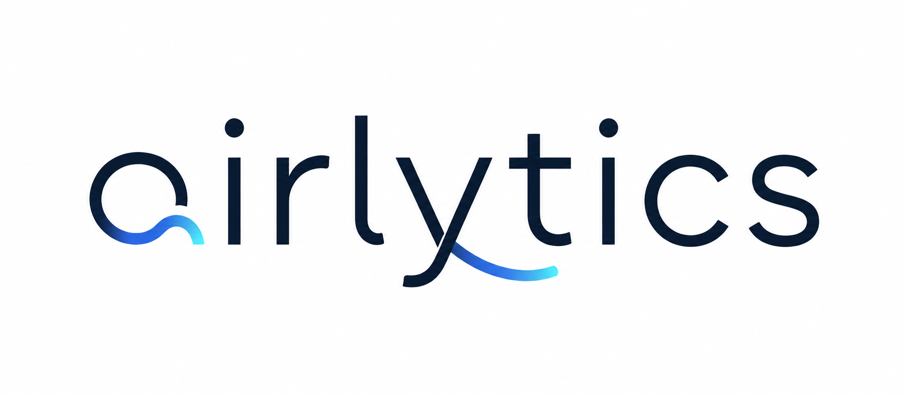

# Airlytics



Personal health analytics dashboard and AI coach. Syncs your Fitbit data through
the Google Health API, stores history locally in SQLite, and shows trends,
anomalies, and readiness on a dashboard with a Groq-powered chat coach on top.
Also trains a small Ridge regression model on your own history to forecast
tomorrow's readiness score, validated against a naive baseline (see the
"Readiness forecast" section on the dashboard).

Single-user, runs on your own machine. No hosting, no accounts, no multi-tenant
anything.

## One-time setup

1. **Google Cloud project** (for OAuth + Google Health API access):

   - Create a project, enable the Google Health API.
   - Configure the OAuth consent screen: External user type, add the three
     scopes below, add your own Google account as a test user.
   - Flip the consent screen to **"In production"** publish status. Skipping
     this means refresh tokens expire every 7 days and sync silently breaks.
     Going to production while unverified just adds a one-time "unverified
     app" click-through on your own login.
   - Create an OAuth 2.0 Client ID, type "Web application", redirect URI
     `http://localhost:8000/api/auth/google/callback`.
   - Scopes needed: `googlehealth.activity_and_fitness.readonly`,
     `googlehealth.health_metrics_and_measurements.readonly`,
     `googlehealth.sleep.readonly`.
2. **Groq API key** for the AI coach: https://console.groq.com
3. Copy `backend/.env.example` to `backend/.env` and fill in:

   - `GOOGLE_CLIENT_ID` / `GOOGLE_CLIENT_SECRET` from step 1.
   - `OAUTH_TOKEN_ENCRYPTION_KEY` — generate with:
     `python -c "from cryptography.fernet import Fernet; print(Fernet.generate_key().decode())"`
   - `GROQ_API_KEY` from step 2.

## Running it

```
cd backend
pip install -e ".[dev]"
alembic upgrade head
uvicorn app.main:app --host 0.0.0.0 --port 8000
```

Then open http://localhost:8000 and click "Connect Google Health".

The frontend loads Roboto, the `marked` markdown renderer, and `DOMPurify` from
CDNs (Google Fonts, jsDelivr) at page load, so it needs internet access even
though the app itself runs locally — the coach chat and page fonts won't render
correctly without it.

Run with exactly **one** uvicorn worker — the background scheduler (sync jobs,
token refresh, nightly rollups/insights) and the manual "Update now" sync
progress tracker both live in-process, and a second worker would duplicate
jobs, race on token refresh, and show inconsistent sync progress.

## Backups

The SQLite file at `backend/data/airlytics.db` is the only copy of your synced
health history. Back it up periodically:

```
cd backend
python scripts/backup_db.py
```

This copies a timestamped snapshot into `backend/data/backups/`. Wire it into
Windows Task Scheduler (or cron, if not on Windows) if you want it automatic —
this script just does the copy, it doesn't schedule itself.

## Tests

```
cd backend
pytest
```

## Evals

A separate eval harness for the AI coach lives at `backend/evals/` — it's not part of the
pytest suite because it hits the **real Groq API** (costs real tokens, non-deterministic)
against a fixed synthetic dataset seeded into a throwaway in-memory DB, then scores each
reply for tool-call correctness and grounding (every number in the reply should trace back
to a tool result, the system prompt, or the question itself). The grounding check is a
rule-based number-matching heuristic, not an LLM judge — deterministic and inspectable, but
it can flag incidental numbers (dates, durations) as false positives; read the per-case
`ungrounded_numbers` in the report before trusting a "FLAGGED" line at face value.

```
cd backend
python -m evals.runner
```

Prints a per-case pass/fail summary and writes a full JSON report to
`backend/evals/results/` (gitignored).
